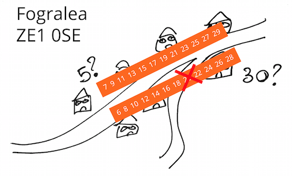

# inference-playground

Why would you need a README.md for something this simple? ;-)

This script tests Open Addresses UK's upcoming first, relatively conservative address inference algorithm vs the latest downloadable edition of the data. The objective is to check the volume of addresses that can be generated before proceeding to proper implementation and integration in the live solution.

If you want to understand what we mean by inferring addresses, read my blog post [here](https://openaddressesuk.org/blog/2015/02/12/inference). Alternatively, bite straight into the pseudocode algorithm [here](https://github.com/theodi/shared/issues/504#issuecomment-72818881).

Open Addresses UK is not just about the team working at OA HQ: [we're looking for partners](https://openaddressesuk.org/blog/2015/01/22/crowdsourcing-challenge) and [contributors](https://openaddressesuk.org/about/addingdata), [our source code is open](https://github.com/openaddressesuk), [our planning is in the open](https://huboard.com/OpenAddressesUK/roadmap/). Perhaps you could write the next inference algorithm, or develop a surveying tool that volunteers can use to tell us if those inferred addresses actually exist or not. Follow us on Twitter at [@OpenAddressesUK](https://twitter.com/openaddressesuk) and keep in touch!

##Licence
This code is open source under the MIT license. See the [LICENSE](LICENCE) file for full details.
